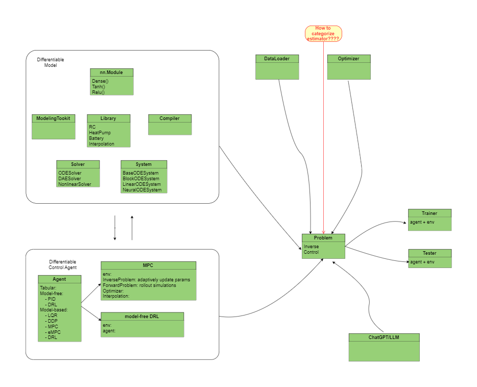

# Dynax

Dynamic system in Jax (Dynax): This repo implements a differentiable simulator for building energy systems to support forward simulation, parameter inference and optimal control.

**NOTE**
This library is still under active development. The APIs are not fully available yet.

# Software Architecture


1. NeuralNetwork: a deep-learning framework based parametric programming module, e.g., pytorch, Flax etc.
2. DataLoader: prepare dynamic system data to trainable and testable data format
3. ModelingTookit: equation-based modeling tool
4. Compiler: compile models to ODE/DAE systems in pure mathematical representation
5. System: define unified system representation based on ODEs/DAEs, such as ODESystem, DAESystem, NeuralODESystem, ..., etc
6. NumericalSolver: define ODE/DAE integration solvers for solving dynamic systems that are typically represented as differential (algebriac) equations.
7. Problem: define a trainable problem, such as forward simulation, inverse simulation, implicit MPC, explicit MPC, model-based DRL, ..., etc
8. Optimizer: define an optimizer for the trainable problem, such as gradient descent
9. Trainer: define a training/learning process for a specific problem
10. TestCases: define some basic test cases to benchmark testing performance

## JAX implementation

### Toochain
- Jax for basic auto-diff operations
- Diffrax for numerical differentiable equation solvers in JAX
- Sympy2jax for differential equation modeling in JAX
- pydae using sundials
- jax examples: https://ericmjl.github.io/dl-workshop/02-jax-idioms/02-loopy-carry.html

## Julia implementation


### Toolchain
- Flux.jl
- DifferentialEquation.jl
- Optimization.jl

# Applications
## Forward Simulation

## Deterministic Parameter Inference

## Bayesian Inference
- Probablistic Programming 
- Bayesian calibration
- Bayesian optimization -> for control what is this?


## Optimal Control

### Dynamic Programming


### LQR


### MPC

The example shew with large RC, the first-order gradient method that requires tuning cannot generate sufficient precooling control sequence, which is counter-intuitive. 


#### Implicit MPC


#### Explicit MPC


### DRL

#### Model-based DRL to Support Value Iteration


#### Explicit Optimization Policy-based DRL

check the paper at https://web.stanford.edu/~boyd/papers/pdf/learning_cocps.pdf

and 

```
B. Amos, I. Jimenez, J. Sacks, B. Boots, and J. Z. Kolter. Differentiable MPC for endto-
end planning and control. In Advances in Neural Information Processing Systems,
pages 8299{8310, 2018.
```

```
M. Okada, L. Rigazio, and T. Aoshima. Path integral networks: End-to-end differentiable
optimal control. arXiv preprint arXiv:1706.09597, 2017.
```

# Use Cases

## Forward Simulation with predefined control inputs
This is an example to simulate cases where the control inputs are predefined over time as an external file, such as csv. 
This case is typical for inverse inference of a given model using existing data.

```python
from dynax.agents import TabularAgent
from dynax.systems import LinearODESystem
from dynax.solvers import Euler

# specifying a piecewise constant control agent from given control sequence
t, u = np.linspace(0, 1, 100), np.random.rand(100)
control = TabularAgent(t, u)

# specifying a linear ODE system
# lode = LinearODESystem()
# specifying a RC model for building energy system
lode = RCModel()

# specifying a numerical solver
solver = Euler()

# specifying a simulator
ds = Simulator(lode, solver)

# simulate the system
ts = 0
te = 1
dt = 0.01
t, y = ds.simulate(ts, te, dt)

```

## Inverse Simulation

```python
from dynax.dataloader import DataLoader
from dynax.agents import TabularAgent
from dynax.utils import LinearInterpolation
from dynax.estimators import LeastSquareEstimator
from dynax.systems import LinearODESystem
from dynax.solvers import Euler
from dynax.problems import InverseProblem
from dynax.optimizers import GradientDescent
from dynax.trainers import Trainer
from dynax.trainers import TrainStates

# load data
data_loader = DataLoader()
data_loader.load_data('data/linear_ode.csv')

# specify a piecewise constant control/disturbance agent
control = TabularAgent(data_loader.t, data_loader.u)
disturbance = LinearInterpolation(data_loader.t, data_loader.d)

# specify a linear ODE system
lode = RCModel(control, disturbance)

# specify a numerical solver
solver = Euler()

# specify a simulator
ds = Simulator(lode, solver)

# specify a least square estimator
estimator = LeastSquareEstimator()

# loss function
def loss_fn(y, y_hat):
    return np.sum((y - y_hat)**2)

# specify a gradient descent optimizer
optimizer = GradientDescent()

# specify an inverse problem:
# y' = f(x, u, d, p)
# min_{p} ||y - y'||^2
inverse_problem = InverseProblem(ds, estimator, params, loss_fn, data_loader, optimizer)

# specify a trainer
trainer = Trainer(inverse_problem, num_epochs=1000, batch_size=100, lr=0.01)

# train the model
trainer.train(data_loader, TrainStates)

```

## Optimal Control: MPC

```python
from dynax.dataloader import DataLoader
from dynax.agents import MPC
from dynax.utils import LinearInterpolation
from dynax.estimators import LeastSquareEstimator
from dynax.systems import LinearODESystem
from dynax.solvers import Euler
from dynax.problems import InverseProblem
from dynax.optimizers import GradientDescent
from dynax.trainers import Trainer
from dynax.trainers import TrainStates

import gymnasium as gym
from envs import building

# load data
data_loader = DataLoader()
data_loader.load_data('data/linear_ode.csv')

# specify a piecewise constant control/disturbance agent
disturbance = LinearInterpolation(data_loader.t, data_loader.d)

# specify a linear ODE system
lode = RCModel()

# specify a numerical solver
solver = Euler()

# specify a simulator
ds = Simulator(lode, solver)

# specify a least square estimator
estimator = LeastSquareEstimator()

# loss function
def loss_fn(y, y_hat):
    return np.sum((y - y_hat)**2)

# specify a gradient descent optimizer
optimizer = GradientDescent()

# specify an implicit MPC control problem
mpc_problem = ImplicitMPCProblem(ds, estimator, params, loss_fn, data_loader, optimizer)

# specify a virtual environment with measurement nosie if possible
env = gym.make('building-v0')

# specify a trainer
trainer = Trainer(mpc_problem, env)

# train the model
trainer.train(data_loader)

# test the model
tester = Tester(mpc_problem, env)
tester.test(data_loader)

```

## Optimal Control: DRL

```python
from dynax.agents.drls.offpolicy import DDQN

```


# Contact

Yangyang Fu

fuyy2008@gmail.com
